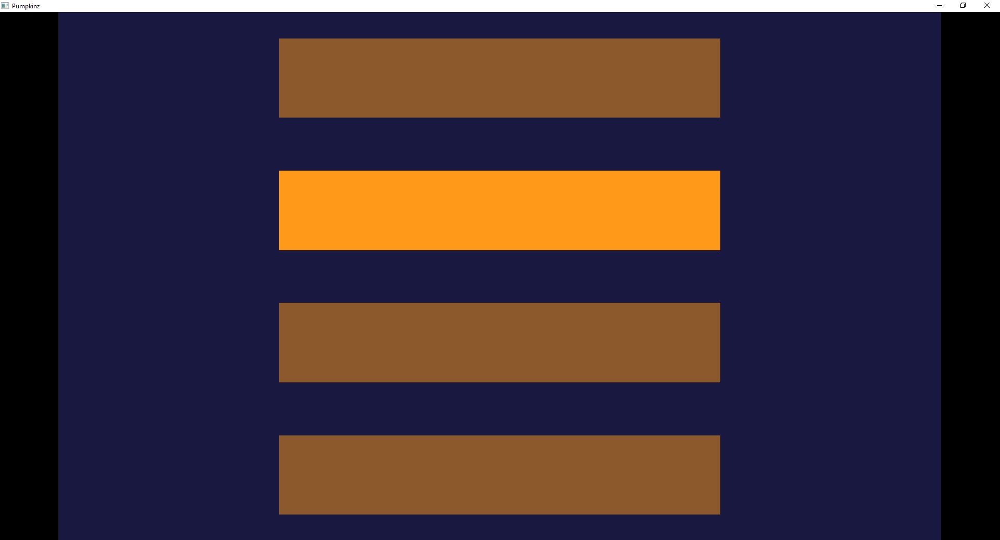
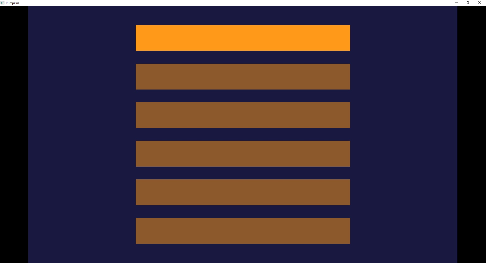
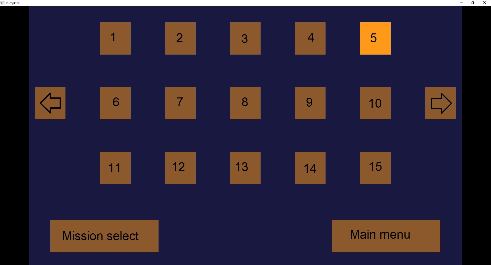
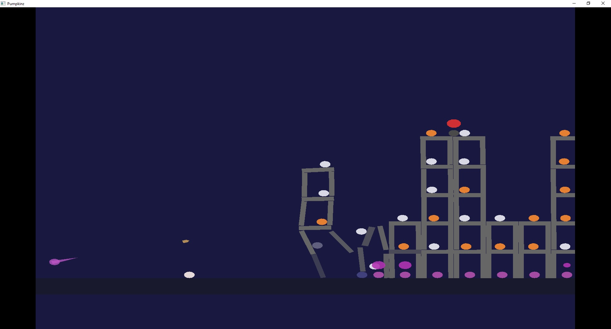
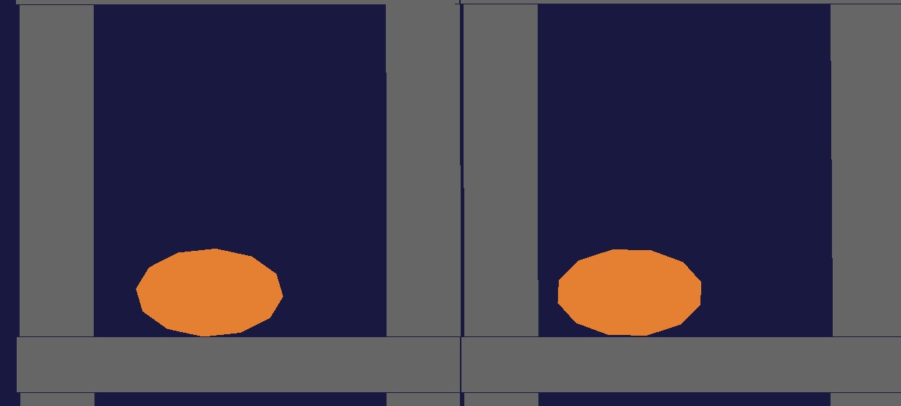
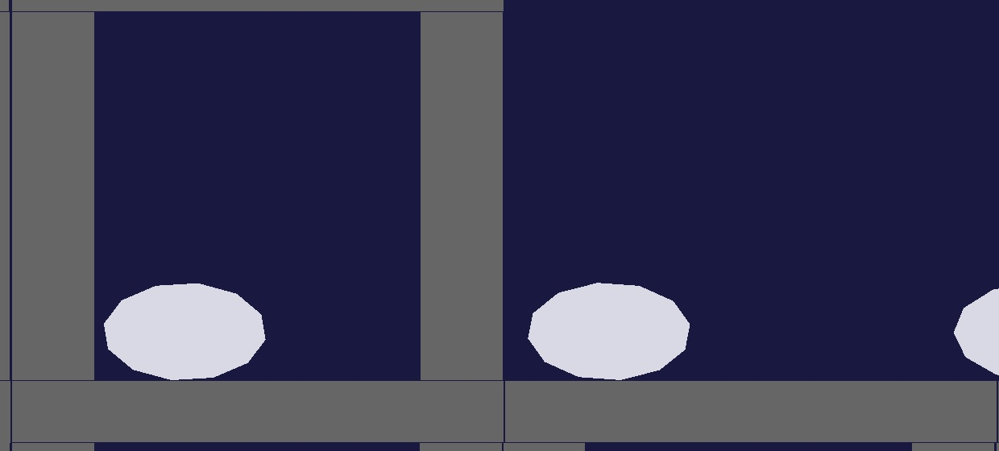
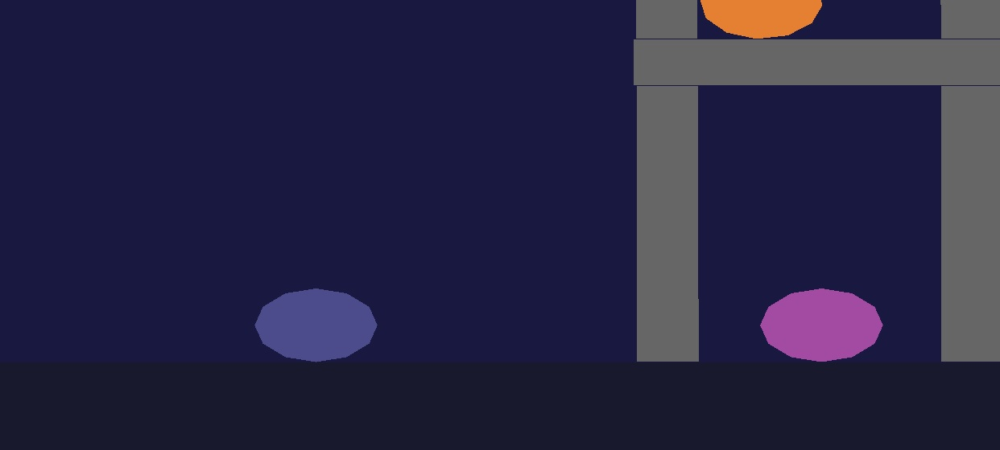
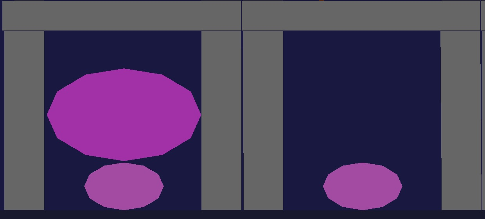
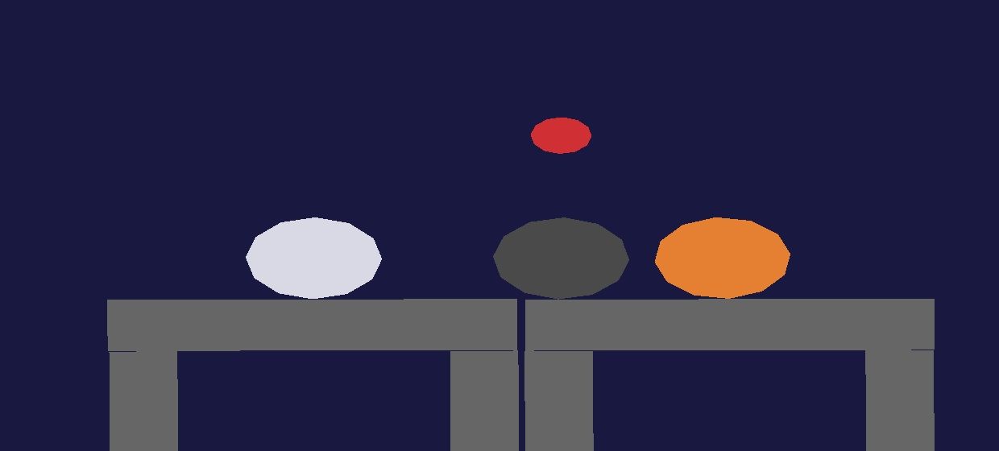

# Preamble

As the game is a WIP the below will end up changing and will be updated as the game is updated.

# Menu navigation

Text and unique colouring on menu buttons have yet to be implemented (lower priority).
This guide has been written to help you understand how to navigate and play the game.
You use the ```left mouse button``` to click on the menu buttons.

## Main Menu



- ```New game/continue game``` -- Not implemented yet
- ```Mission select``` -- Opens region select menu
- ```Help/Tutorial``` -- Not implemented yet
- ```Exit``` -- Kills the program

## Region Menu



- ```Pumpkin patch``` -- Contains 5 active missions
- ```Haunted house``` -- No active missions
- ```Cemetery``` -- No active missions
- ```Cursed forest``` -- No active missions
- ```Vampire castle``` -- Contains 1 active mission
- ```Return to menu``` -- Returns to main menu

The demo mission that uses all the currently implemented enemy types is found in vampire castle.

## Mission Menu



- ```Mission select (1-15)``` -- Runs that mission if it's implemented
- ```Left/Right sliders``` -- Not implemented but will shift the displayed missions by +/- 15
- ```Mission select``` -- Returns to region menu
- ```Main menu``` -- Returns to main menu

# In game



When in game you can press ```Esc``` to return to the mission menu.

## Controls

You control the purple cannon and the camera.

- ```Move the cursor``` -- Cannon will aim directly at your cursor
- ```Left mouse button``` -- Will fire a non-explosive bullet
- ```Right mouse button``` -- Will fire an explosive round
- ```WASD``` -- Will pan the camera
- ```Mouse scroll wheel``` -- Will zoom the camera in and out
- ```Esc``` -- Returns to the mission menu

## Enemies

### Pumpkin



Very weak and basic enemy, no powers or effects.

### Skeleton



More durable enemy, turns into a gravestone after death.

### Ghost


Very weak enemy, but takes no fall damage.

### Gravestone



Durable object, can be reanimated into a skeleton by a necromancer.

### Necromancer


Durable enemy, can raise skeletons from gravestones.
It's necromancy spell is bright green.
Also turns into a gravestone after death.

### Witch



Enemy, can heal damaged enemies and objects.
It's restoration spell is purple.
Also turns into a gravestone after death.

### Vampire



Enemy that takes no fall damage, and harms your projectiles.
It's vampirism spell is red.
Also turns into a gravestone after death.

## Goal

As of now there is no implemented win mechanics,
but the ultimate goal will be to kill all enemies with as few shots as possible.
For now just press ```Esc``` when you're finished in a mission.
