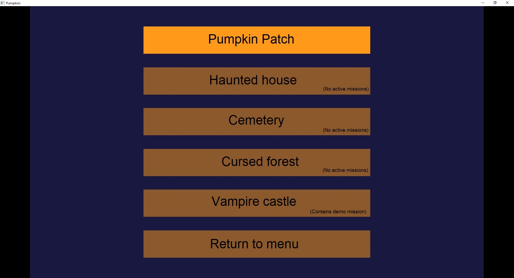

# Preamble

As the game is a WIP the below will end up chaning and will be updated with the game itself.

# Menu navigation

Text and unique colouring on menu buttons have yet to be implemented (lower priority).
This guide has been written to help you understand how to navigate and play the game.

## Main Menu


- ```New game/continue game``` -- Not implemented yet
- ```Mission select``` -- Opens region select menu
- ```Help/Tutorial``` -- Not implemented yet
- ```Exit``` -- Kills the program

## Region Menu



- ```Pumpkin patch``` -- Contains 1 active mission
- ```Haunted house``` -- No active missions
- ```Cemetery``` -- No active missions
- ```Cursed forest``` -- No active missions
- ```Vampire castle``` -- No active missions
- ```Return to menu``` -- Returns to main menu

As of now only mission 5 of the pumpkin patch region is active.
It runs a demo mission that uses all the currently implemented enemy types.

## Mission Menu


- ```Mission select (1-15)``` -- Runs that mission if it's implemented
- ```Left/Right sliders``` -- Not implemented but will shift the displayed missions by +/- 15
- ```Mission select``` -- Returns to region menu
- ```Main menu``` -- Returns to main menu

# In game


When in game you can press ```Esc``` to return to the mission menu.
